# Voltzy Professional Platform

A comprehensive service management platform connecting professionals with homeowners for instant service requests, featuring real-time job tracking, smart dispatching, and seamless communication.

## Overview

Voltzy Professional is a Flutter-based mobile application that enables service professionals to:
- Respond to instant job broadcasts
- Track real-time service requests
- Handle real-time location updates and navigation
- Process quotes and invoices
- Maintain service history

### Job Flow
1. Homeowner broadcasts an instant job request
2. Nearby professionals receive the broadcast
3. Professionals can view job details and respond
4. Homeowner selects a professional
5. Professional proceeds with the service
6. Job completion and payment

## System Architecture

### Tech Stack
- **Frontend**: Flutter/Dart
- **State Management**: Riverpod
- **Backend**: [To be defined]
- **Database**: PostgreSQL
- **Real-time Updates**: [To be defined]
- **Maps & Navigation**: [To be defined]

### Core Features

1. **Instant Job Management**
   - Real-time job broadcasts
   - Quick response system
   - Location-based matching
   - Service tracking

2. **Professional Tools**
   - Quote generation
   - Materials tracking
   - Time tracking
   - Completion checklists

3. **Client Communication**
   - Real-time status updates
   - In-app messaging
   - Service documentation
   - Review system

## Navigation Structure

### Main Navigation Pattern
The app will use a combination of bottom navigation for primary screens and a drawer for additional features and settings. This provides quick access to core functionality while keeping secondary features accessible but uncluttered.

### Bottom Navigation Screens

1. **Home Screen (Dashboard)**
   - Primary landing screen
   - Shows professional's current status (Online/Offline)
   - Active job broadcasts in the area
   - Quick stats (Today's earnings, response rate)
   - Action buttons for availability toggle

2. **Active Job Screen**
   - Context-aware view that changes based on job stage
   - Shows when professional has an active job
   - Replaces job broadcasts when in active job
   - States:
     - En Route (Map View)
     - At Location (Diagnosis View)
     - Quote Creation
     - In Progress
     - Completion

3. **History Screen**
   - List of completed jobs
   - Earnings history
   - Job statistics
   - Filterable by date range
   - Searchable by job details

4. **Messages Screen**
   - Chat conversations with clients
   - Job-related communications
   - Notification badges
   - Quick actions for responses

### Active Job Screen Details

#### Overview
The Active Job Screen is a dynamic view that appears in the bottom navigation when a professional has an active job. It provides a comprehensive interface for managing the current job through various stages, with each stage having its own specialized view and functionality.

#### Core Components

1. **Progress Tracker**
   ```mermaid
   stateDiagram-v2
       [*] --> EnRoute
       EnRoute --> AtLocation
       AtLocation --> Diagnosis
       Diagnosis --> QuoteCreation
       QuoteCreation --> InProgress
       InProgress --> Completion
   ```

2. **Stage Navigation**
   - Visual progress bar showing all stages
   - Current stage highlighted
   - Completed stages marked
   - Upcoming stages greyed out
   - Stage transition animations

3. **Common Elements**
   - Job timer display
   - Emergency support access
   - Client contact options
   - Job details quick view
   - Stage-specific action buttons
   - Notes/documentation field

4. **Persistent Information**
   - Client name and contact
   - Job ID and type
   - Location details
   - Start time
   - Current stage duration
   - Total job duration

#### Stage Transition Logic
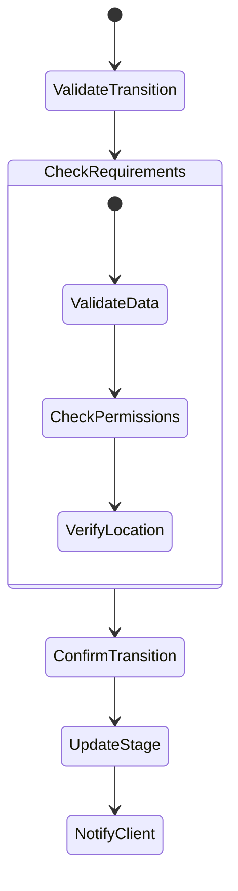
```mermaid
stateDiagram-v2
    [*] --> ValidateTransition
    ValidateTransition --> CheckRequirements
    CheckRequirements --> ConfirmTransition
    ConfirmTransition --> UpdateStage
    UpdateStage --> NotifyClient
    
    state CheckRequirements {
        [*] --> ValidateData
        ValidateData --> CheckPermissions
        CheckPermissions --> VerifyLocation
    }
```

#### Error Handling
- Stage transition failures
- Network connectivity issues
- Location accuracy problems
- Client communication failures
- Emergency situations
- Data synchronization errors

#### Stage Views

##### 1. En Route Stage
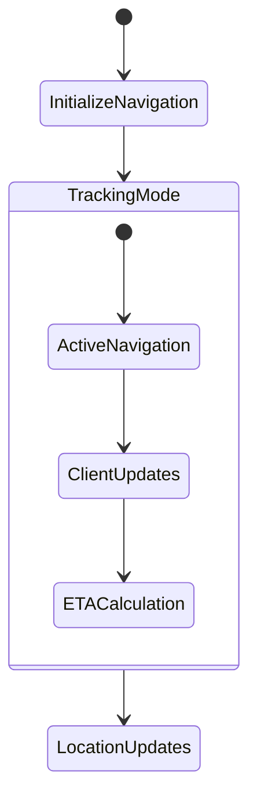
```mermaid
stateDiagram-v2
    [*] --> InitializeNavigation
    InitializeNavigation --> TrackingMode
    TrackingMode --> LocationUpdates
    
    state TrackingMode {
        [*] --> ActiveNavigation
        ActiveNavigation --> ClientUpdates
        ClientUpdates --> ETACalculation
    }
```

###### Components
1. **Map View**
   - Full-screen interactive map
   - Professional's current location
   - Client's location marker
   - Optimal route display
   - Traffic information overlay
   - Alternative routes
   - Zoom controls
   - Location accuracy indicator

2. **Navigation Panel**
   - Turn-by-turn directions
   - Distance remaining
   - ETA display
   - Speed limit information
   - Traffic alerts
   - Route recalculation option
   - Voice navigation toggle

3. **Status Bar**
   - Current stage indicator
   - Time elapsed
   - Distance covered
   - Average speed
   - Estimated arrival time
   - Connection status
   - GPS signal strength

4. **Action Controls**
   - "I've Arrived" button
   - Call client button
   - Message client button
   - Navigation settings
   - Report issue button
   - Emergency assistance
   - Cancel job option

###### Features
1. **Location Tracking**
   ```dart
   class LocationUpdate {
     final double latitude;
     final double longitude;
     final double accuracy;
     final double speed;
     final double heading;
     final DateTime timestamp;
   }
   ```

2. **Client Updates**
   - Automatic ETA notifications
   - Location sharing updates
   - Arrival proximity alerts
   - Traffic delay notifications
   - Route change notifications

3. **Navigation Options**
   - Preferred route selection
   - Avoid tolls/highways
   - Alternative routes
   - Voice navigation settings
   - Map type selection
   - Night mode toggle

4. **Safety Features**
   - Hands-free operation
   - Voice commands
   - Large button interfaces
   - Quick action shortcuts
   - Emergency contacts
   - Incident reporting

###### State Management
```dart
@riverpod
class EnRouteState extends _$EnRouteState {
  @override
  Stream<EnRouteStatus> build(String jobId) {
    return _locationService
        .getPositionStream()
        .map((position) => _calculateStatus(position));
  }

  EnRouteStatus _calculateStatus(Position position) {
    final distanceToClient = _calculateDistance(position);
    final eta = _calculateETA(position);
    
    return EnRouteStatus(
      currentLocation: position,
      distanceRemaining: distanceToClient,
      estimatedArrival: eta,
      hasArrived: distanceToClient < 50, // meters
    );
  }
}
```

###### Error Handling
1. **Location Errors**
   - GPS signal loss
   - Accuracy degradation
   - Mock location detection
   - Geofence violations
   - Rapid location changes

2. **Navigation Errors**
   - Route calculation failure
   - Traffic data unavailable
   - Map loading issues
   - Direction service errors
   - Offline mode handling

3. **Communication Errors**
   - Failed client updates
   - Message delivery failure
   - Call connection issues
   - Network connectivity loss
   - Server synchronization fails

###### UI/UX Considerations
1. **Accessibility**
   - Voice guidance
   - High contrast map
   - Large touch targets
   - Screen reader support
   - Haptic feedback
   - Motion sensitivity

2. **Performance**
   - Efficient map rendering
   - Background location updates
   - Battery optimization
   - Data usage management
   - Cache management
   - Memory optimization

3. **Safety**
   - Distraction minimization
   - Voice control priority
   - Emergency shortcuts
   - Quick client contact
   - Incident reporting
   - Location sharing

##### 2. At Location Stage
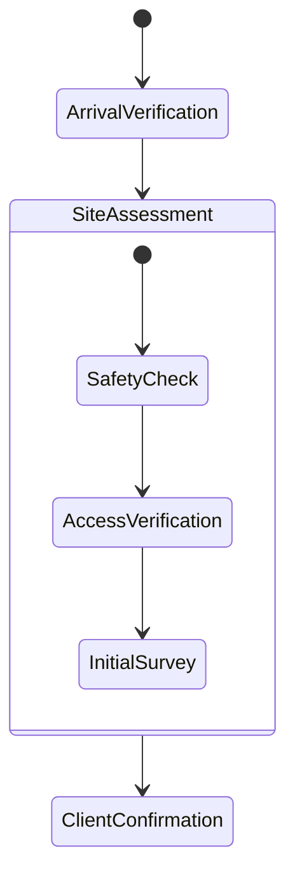
```mermaid
stateDiagram-v2
    [*] --> ArrivalVerification
    ArrivalVerification --> SiteAssessment
    SiteAssessment --> ClientConfirmation
    
    state SiteAssessment {
        [*] --> SafetyCheck
        SafetyCheck --> AccessVerification
        AccessVerification --> InitialSurvey
    }
```

###### Components
1. **Arrival Verification**
   - GPS location confirmation
   - Property photo capture
   - Client notification system
   - Arrival time recording
   - Job site verification
   - Access instructions display
   - Parking information

2. **Safety Assessment**
   - Site safety checklist
   - Hazard identification
   - Required PPE list
   - Emergency exit locations
   - First aid kit verification
   - Weather conditions check
   - Environmental hazards

3. **Client Interaction**
   - Arrival confirmation
   - Initial greeting script
   - COVID-19 protocols
   - Service verification
   - Special instructions review
   - Client preferences note
   - Contact preferences

4. **Site Survey Tools**
   - Area measurement tools
   - Photo documentation
   - Voice note recording
   - Quick sketch capability
   - Site condition notes
   - Access point marking
   - Equipment placement

###### Features
1. **Location Verification**
   ```dart
   class ArrivalVerification {
     final String jobId;
     final GeoLocation professionalLocation;
     final GeoLocation clientLocation;
     final double arrivalAccuracy;
     final DateTime arrivalTime;
     final List<String> photoUrls;
     final String accessNotes;
   }
   ```

2. **Safety Protocol**
   - Automated safety checklist
   - Risk assessment form
   - Required equipment list
   - Safety gear verification
   - Hazard documentation
   - Emergency procedures
   - Incident reporting

3. **Client Communication**
   - Arrival notification
   - Service confirmation
   - Special instructions
   - Access requirements
   - Initial assessment
   - Timeline estimation
   - Next steps preview

4. **Documentation Tools**
   - Photo capture system
   - Voice note recorder
   - Text note editor
   - Sketch pad
   - Measurement recorder
   - Condition reporter
   - Issue logger

###### State Management
```dart
@riverpod
class AtLocationState extends _$AtLocationState {
  @override
  Stream<AtLocationStatus> build(String jobId) {
    return _arrivalService
        .verifyArrival(jobId)
        .asyncMap((verified) => _processArrival(verified));
  }

  Future<AtLocationStatus> _processArrival(bool verified) async {
    if (!verified) {
      throw LocationVerificationException();
    }

    final siteAssessment = await _performInitialAssessment();
    final clientConfirmation = await _notifyClient();
    
    return AtLocationStatus(
      verified: true,
      siteAssessed: siteAssessment.completed,
      clientConfirmed: clientConfirmation.received,
      canProceedToDiagnosis: _canProceed(siteAssessment, clientConfirmation),
      arrivalTime: DateTime.now(),
    );
  }
}
```

###### Error Handling
1. **Verification Errors**
   - Location mismatch
   - GPS accuracy issues
   - Photo upload failures
   - Client verification timeout
   - Access problems
   - System verification fails

2. **Safety Concerns**
   - Hazardous conditions
   - Weather issues
   - Access restrictions
   - Equipment problems
   - Emergency situations
   - Security concerns

3. **Client Issues**
   - No response
   - Access denied
   - Service mismatch
   - Special requirements
   - Communication problems
   - Schedule conflicts

###### UI/UX Considerations
1. **Accessibility**
   - Clear instructions
   - Large action buttons
   - Voice commands
   - High contrast UI
   - Audio confirmations
   - Haptic feedback

2. **Efficiency**
   - Quick actions menu
   - Gesture shortcuts
   - Voice input support
   - Auto-fill capabilities
   - Smart defaults
   - Context awareness

3. **Safety First**
   - Emergency button
   - Quick exit option
   - Safety alerts
   - Weather warnings
   - Hazard indicators
   - Support contact

4. **Client Experience**
   - Professional appearance
   - Clear communication
   - Progress visibility
   - Expectation setting
   - Service explanation
   - Next steps preview

###### Transition Requirements
1. **To Proceed to Diagnosis**
   - Location verified
   - Safety check passed
   - Client confirmed
   - Access granted
   - Equipment ready
   - Documentation complete

2. **Validation Checks**
   - GPS accuracy
   - Photo quality
   - Safety compliance
   - Client approval
   - System readiness
   - Time tracking

3. **Data Collection**
   - Arrival details
   - Site conditions
   - Safety notes
   - Client preferences
   - Access information
   - Initial observations

### Drawer Menu Items
- Profile Settings
- Service Area Management
- Documents & Licenses
- Payment Information
- Help & Support
- Terms & Conditions
- Privacy Policy
- App Settings
- Logout

### Home Screen States

#### 1. Offline State
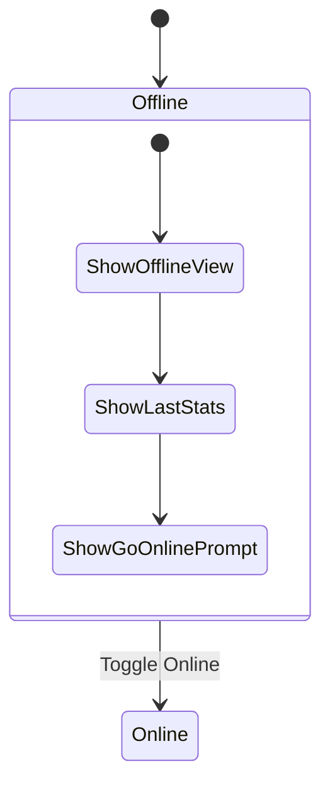
```mermaid
stateDiagram-v2
    [*] --> Offline
    Offline --> Online: Toggle Online
    
    state Offline {
        [*] --> ShowOfflineView
        ShowOfflineView --> ShowLastStats
        ShowLastStats --> ShowGoOnlinePrompt
    }
```
- Large "Go Online" button
- Last session statistics
- Quick access to profile completion items
- Service area map preview
- Offline duration counter

#### 2. Online State (No Active Jobs)
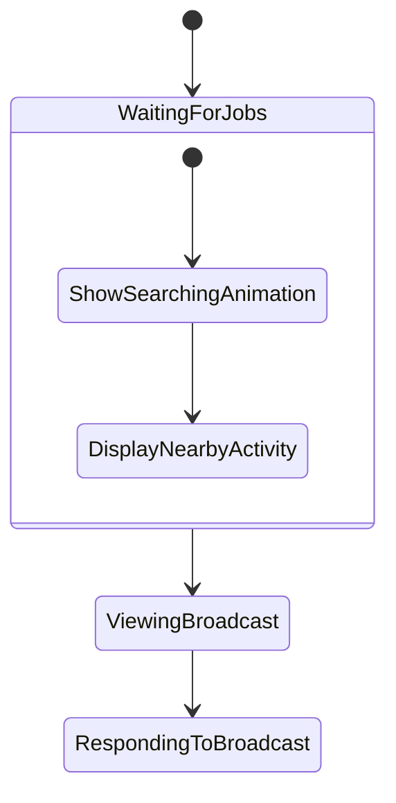
```mermaid
stateDiagram-v2
    [*] --> WaitingForJobs
    WaitingForJobs --> ViewingBroadcast
    ViewingBroadcast --> RespondingToBroadcast
    
    state WaitingForJobs {
        [*] --> ShowSearchingAnimation
        ShowSearchingAnimation --> DisplayNearbyActivity
    }
```
- Active "Searching for Jobs" indicator
- Real-time job broadcast cards
- Quick response actions
- Current location indicator
- Online duration counter
- Today's earnings display
- Response rate indicator

#### 3. Online State (With Active Job)
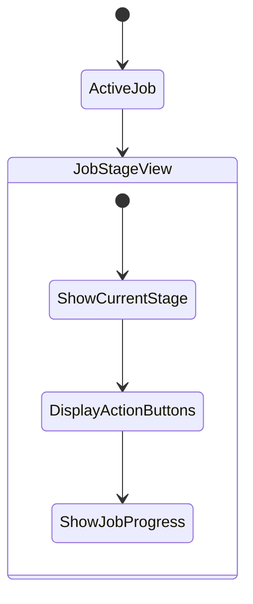
```mermaid
stateDiagram-v2
    [*] --> ActiveJob
    ActiveJob --> JobStageView
    
    state JobStageView {
        [*] --> ShowCurrentStage
        ShowCurrentStage --> DisplayActionButtons
        DisplayActionButtons --> ShowJobProgress
    }
```
- Current job stage prominently displayed
- Stage-specific action buttons
- Job timer
- Client information
- Quick message access
- Navigation actions
- Emergency support access

### Screen Transitions
- Smooth fade transitions between states
- Sliding transitions for job cards
- Scale animations for status changes
- Loading state indicators
- Pull-to-refresh for updates

### Active Job Screen States

#### 1. En Route State
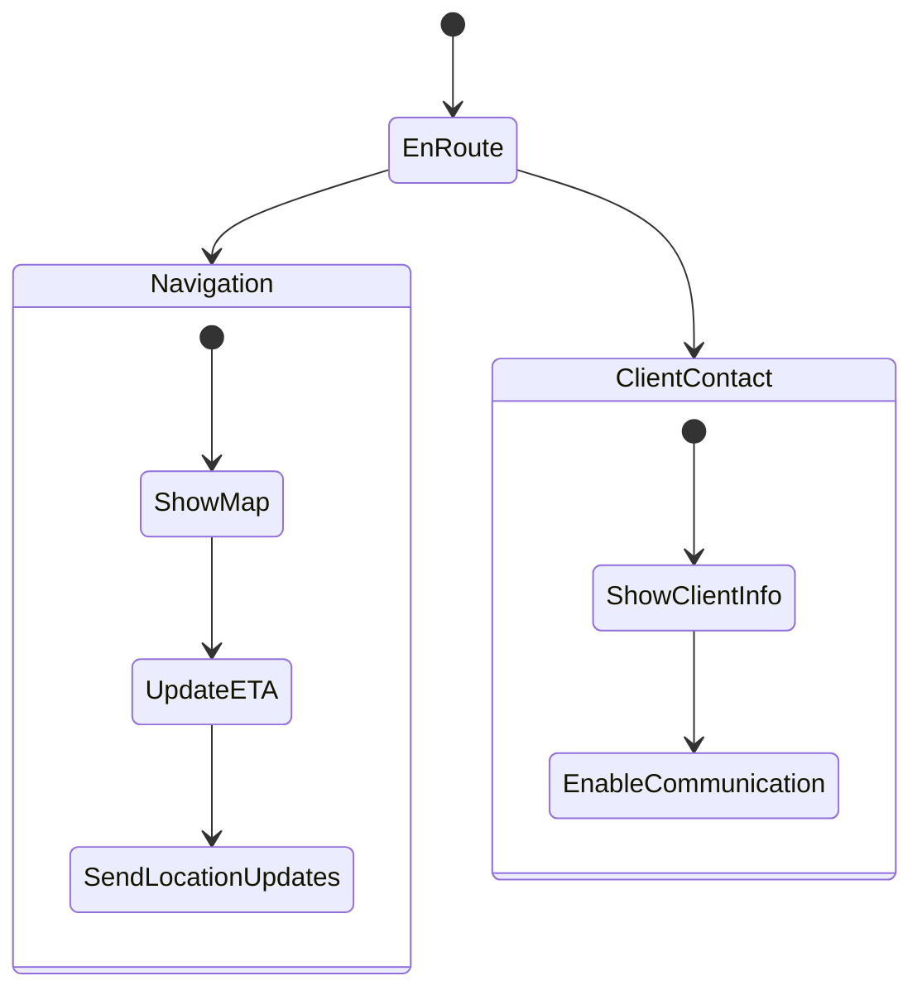
```mermaid
stateDiagram-v2
    [*] --> EnRoute
    EnRoute --> Navigation
    EnRoute --> ClientContact
    
    state Navigation {
        [*] --> ShowMap
        ShowMap --> UpdateETA
        UpdateETA --> SendLocationUpdates
    }
    
    state ClientContact {
        [*] --> ShowClientInfo
        ShowClientInfo --> EnableCommunication
    }
```

**Components:**
- Full-screen map view
- ETA display
- Turn-by-turn navigation
- Client location marker
- Quick actions overlay:
  - Call client
  - Message client
  - View job details
  - Report issue
- "I've Arrived" button
- Job timer
- Cancel job option

#### 2. At Location State
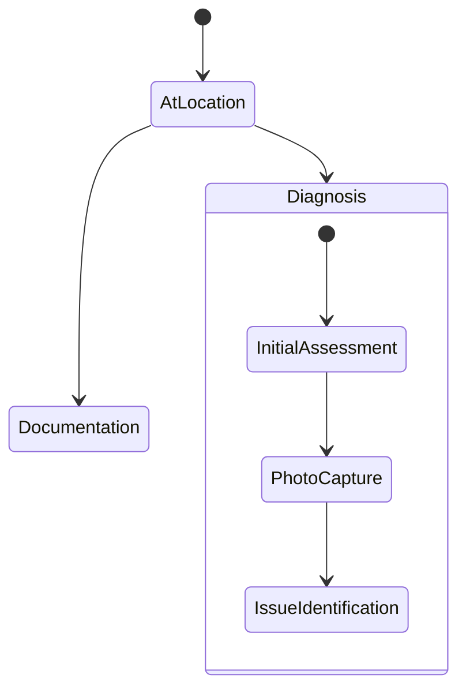
```mermaid
stateDiagram-v2
    [*] --> AtLocation
    AtLocation --> Diagnosis
    AtLocation --> Documentation
    
    state Diagnosis {
        [*] --> InitialAssessment
        InitialAssessment --> PhotoCapture
        PhotoCapture --> IssueIdentification
    }
```

**Components:**
- Diagnosis checklist
- Photo capture interface
- Issue documentation form
- Client confirmation required
- Material requirements list
- Time estimation tool
- Quote preparation button
- Emergency support access

#### 3. Quote Creation State
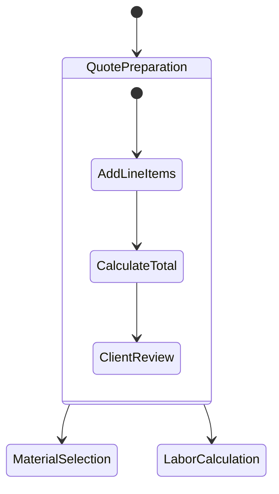
```mermaid
stateDiagram-v2
    [*] --> QuotePreparation
    QuotePreparation --> MaterialSelection
    QuotePreparation --> LaborCalculation
    
    state QuotePreparation {
        [*] --> AddLineItems
        AddLineItems --> CalculateTotal
        CalculateTotal --> ClientReview
    }
```

**Components:**
- Line item entry
- Material selection
- Labor cost calculator
- Tax calculation
- Total estimation
- Quote preview
- Send for approval button
- Edit/Update options
- Save as draft

#### 4. In Progress State
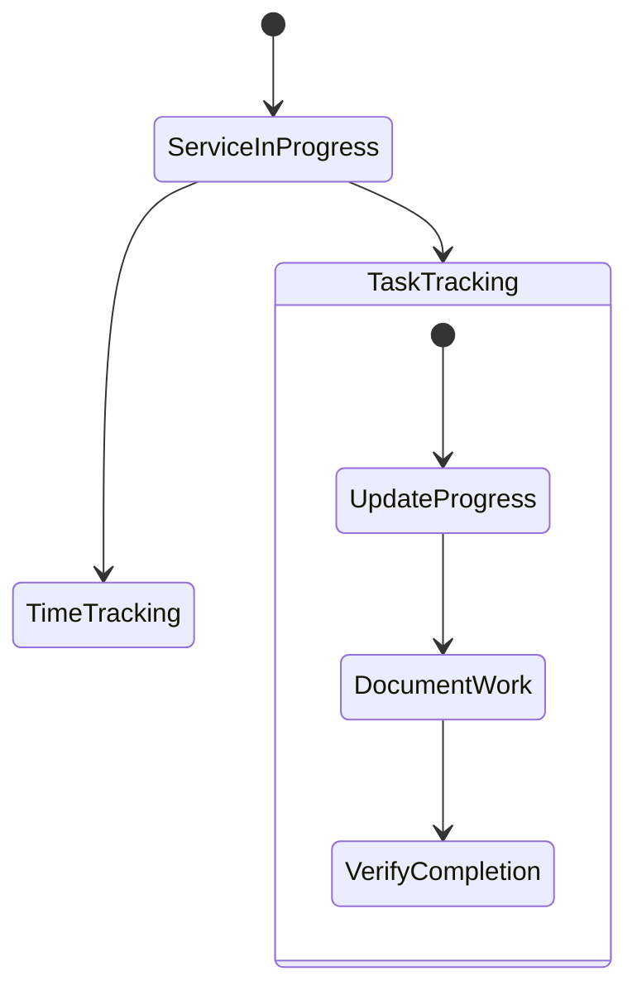
```mermaid
stateDiagram-v2
    [*] --> ServiceInProgress
    ServiceInProgress --> TaskTracking
    ServiceInProgress --> TimeTracking
    
    state TaskTracking {
        [*] --> UpdateProgress
        UpdateProgress --> DocumentWork
        DocumentWork --> VerifyCompletion
    }
```

**Components:**
- Progress checklist
- Time tracking
- Material usage logging
- Photo documentation
- Client communication
- Issue reporting
- Pause/Resume options
- Complete service button

#### 5. Completion State
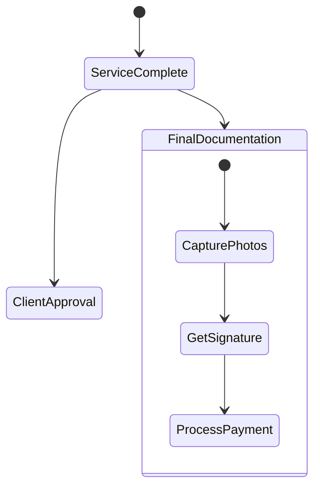
```mermaid
stateDiagram-v2
    [*] --> ServiceComplete
    ServiceComplete --> FinalDocumentation
    ServiceComplete --> ClientApproval
    
    state FinalDocumentation {
        [*] --> CapturePhotos
        CapturePhotos --> GetSignature
        GetSignature --> ProcessPayment
    }
```

**Components:**
- Final checklist verification
- Before/After photos
- Client signature capture
- Payment processing
- Feedback request
- Service warranty info
- Follow-up scheduling
- Job summary

### State Transitions and UI Patterns

#### Navigation Patterns
- Swipe gestures for related actions
- Bottom sheet for detailed information
- Modal overlays for critical actions
- Floating action buttons for primary actions
- Pull-to-refresh for updates
- Slide-up panels for additional options

#### State Management
- Automatic state persistence
- Background location updates
- Offline support with sync
- Real-time status updates
- Error recovery flows
- Session management

#### UI Components
- Progress indicators
- Status badges
- Action buttons
- Information cards
- Alert dialogs
- Toast messages
- Loading overlays

### History Screen Details

#### 1. Main View Structure
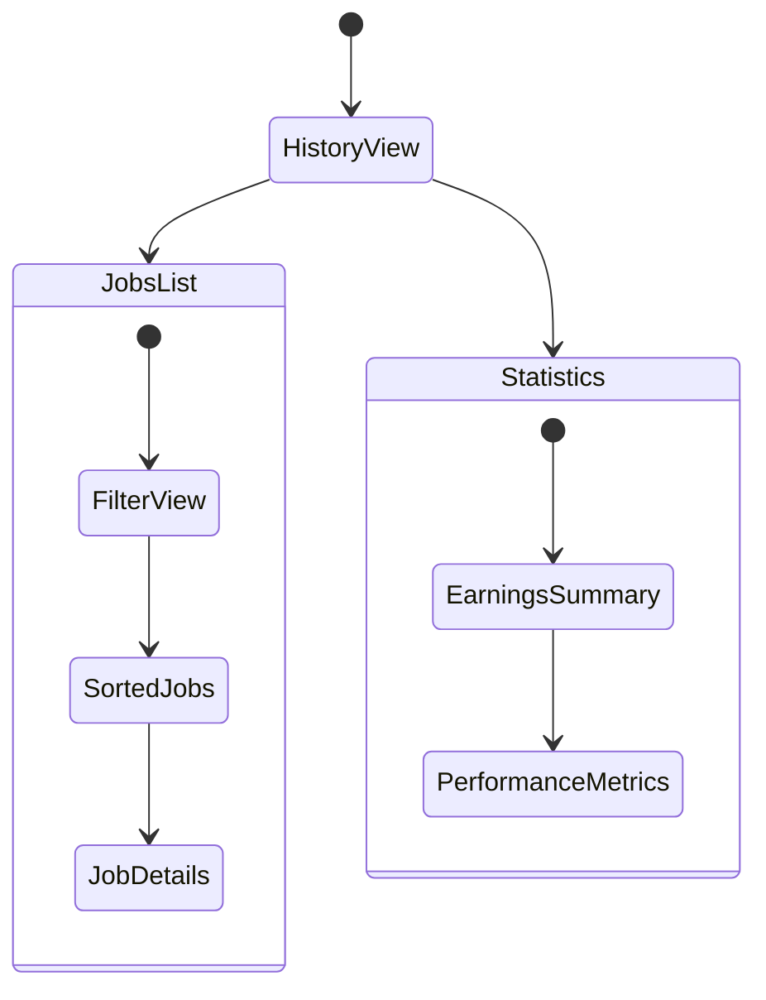
```mermaid
stateDiagram-v2
    [*] --> HistoryView
    HistoryView --> JobsList
    HistoryView --> Statistics
    
    state JobsList {
        [*] --> FilterView
        FilterView --> SortedJobs
        SortedJobs --> JobDetails
    }
    
    state Statistics {
        [*] --> EarningsSummary
        EarningsSummary --> PerformanceMetrics
    }
```

#### 2. Components

##### Jobs List Section
- Filter options:
  - Date range picker
  - Service type filter
  - Status filter
  - Client filter
- Sort options:
  - Date (newest/oldest)
  - Earnings (highest/lowest)
  - Duration (longest/shortest)
- Job card information:
  - Date and time
  - Service type
  - Client name
  - Location
  - Earnings
  - Status badge
  - Rating received

##### Statistics Section
- Earnings breakdown:
  - Daily chart
  - Weekly summary
  - Monthly comparison
  - Year-to-date total
- Performance metrics:
  - Average rating
  - Response rate
  - Completion rate
  - Cancellation rate
- Service analysis:
  - Most common services
  - Average job duration
  - Peak hours/days
  - Popular locations

#### 3. Interactions
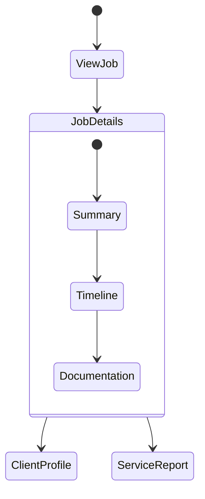
```mermaid
stateDiagram-v2
    [*] --> ViewJob
    ViewJob --> JobDetails
    JobDetails --> ClientProfile
    JobDetails --> ServiceReport
    
    state JobDetails {
        [*] --> Summary
        Summary --> Timeline
        Timeline --> Documentation
    }
```

##### Job Details View
- Complete job timeline
- All communications
- Service documentation
- Payment details
- Client feedback
- Issue reports
- Materials used
- Time logs

##### Export Options
- Generate PDF report
- Share job summary
- Download invoice
- Export statistics
- Save documentation

#### 4. UI Elements

##### List View Features
- Infinite scroll
- Pull-to-refresh
- Quick search
- Filter chips
- Sort dropdown
- Grid/List toggle
- Batch selection

##### Statistics View Features
- Interactive charts
- Date range selector
- Metric comparisons
- Trend indicators
- Performance insights
- Goal tracking

#### 5. Data Management
- Local caching
- Pagination
- Background sync
- Data compression
- Offline access
- Auto-archiving
- Backup options

### Messages Screen Details

#### 1. Screen Structure
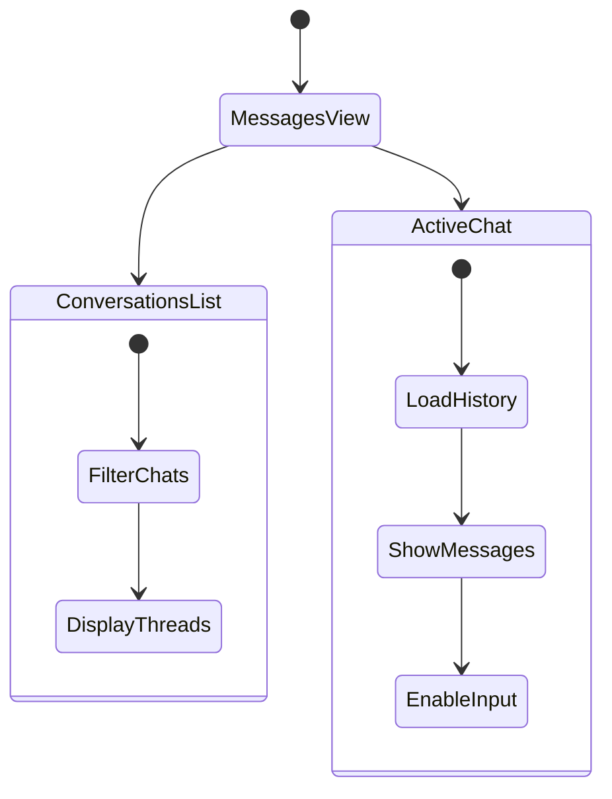
```mermaid
stateDiagram-v2
    [*] --> MessagesView
    MessagesView --> ConversationsList
    MessagesView --> ActiveChat
    
    state ConversationsList {
        [*] --> FilterChats
        FilterChats --> DisplayThreads
    }
    
    state ActiveChat {
        [*] --> LoadHistory
        LoadHistory --> ShowMessages
        ShowMessages --> EnableInput
    }
```

#### 2. Conversations List

##### List Components
- Search conversations
- Filter options:
  - Active jobs
  - Recent chats
  - Unread messages
  - Archived chats
- Conversation preview:
  - Client name/photo
  - Job reference
  - Last message preview
  - Timestamp
  - Unread indicator
  - Online status
  - Typing indicator

##### Organization
- Pinned conversations
- Active job chats
- Recent conversations
- Archived chats
- Group by date
- Priority sorting

#### 3. Chat View

##### Message Types
- Text messages
- Image attachments
- Location shares
- Job updates
- Quote sharing
- Payment requests
- System notifications
- Quick replies

##### Features
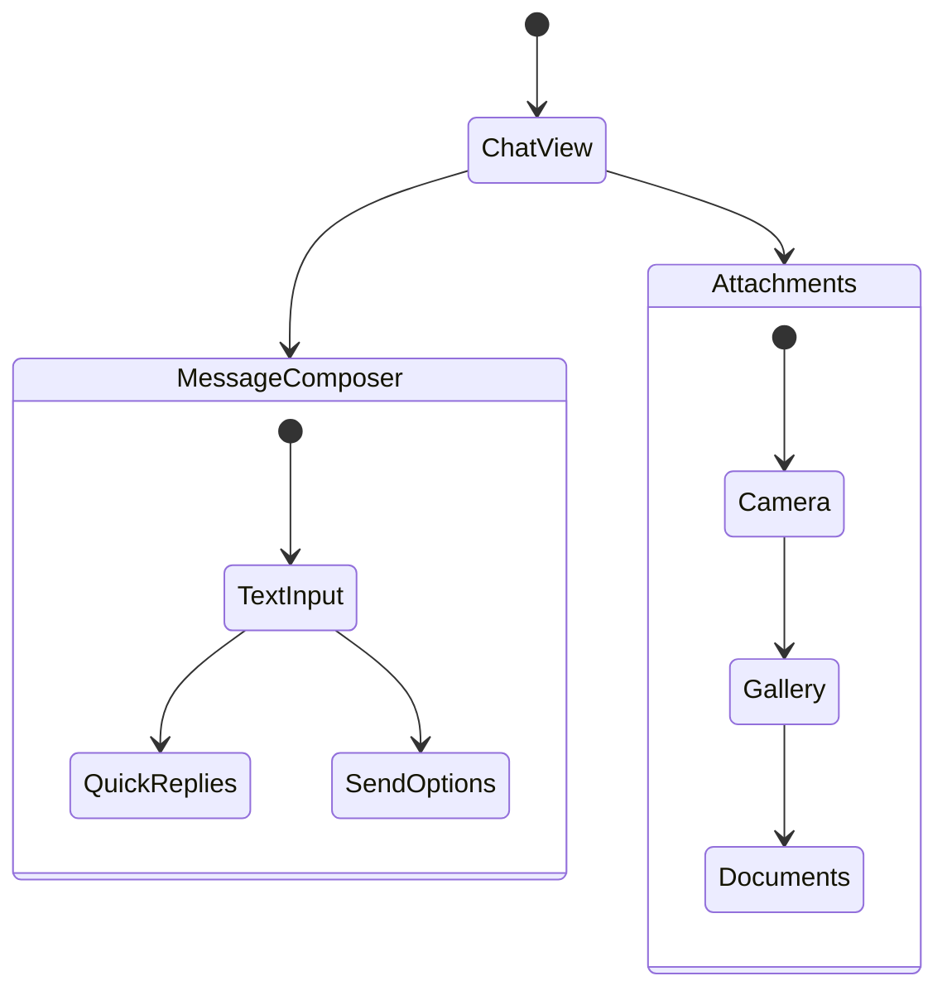
```mermaid
stateDiagram-v2
    [*] --> ChatView
    ChatView --> MessageComposer
    ChatView --> Attachments
    
    state MessageComposer {
        [*] --> TextInput
        TextInput --> QuickReplies
        TextInput --> SendOptions
    }
    
    state Attachments {
        [*] --> Camera
        Camera --> Gallery
        Gallery --> Documents
    }
```

##### UI Elements
- Message bubbles
- Timestamp display
- Read receipts
- Typing indicators
- File previews
- Progress indicators
- Error states
- Retry options

#### 4. Job Context Integration

##### Job-Related Features
- View job details
- Share location
- Send quotes
- Request payments
- Schedule updates
- Share documents
- Report issues
- Request support

##### Quick Actions
- Call client
- Share location
- Send quote
- View job
- Block client
- Report issue
- Archive chat
- Clear history

#### 5. Technical Features

##### Real-time Capabilities
- Message delivery
- Read receipts
- Online presence
- Typing indicators
- Media upload
- Push notifications
- Offline support
- Message sync

##### Security Features
- End-to-end encryption
- Message expiration
- Media encryption
- Access control
- Report system
- Backup/restore
- Privacy settings

#### 6. UI/UX Considerations

##### Accessibility
- Voice messages
- Image descriptions
- Text scaling
- High contrast
- Screen reader
- Keyboard navigation
- Haptic feedback

##### Performance
- Lazy loading
- Image optimization
- Background sync
- Cache management
- Compression
- Offline first
- Battery efficient

[More sections to follow in subsequent updates...]

## Database Schema

### Core Entities

#### Users and Authentication
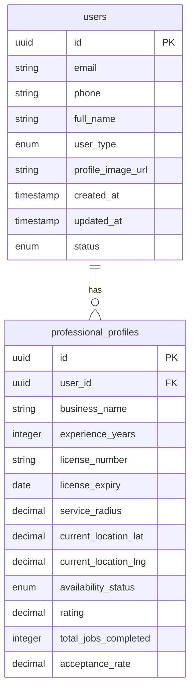
```mermaid
erDiagram
    users ||--o{ professional_profiles : has
    users {
        uuid id PK
        string email
        string phone
        string full_name
        enum user_type
        string profile_image_url
        timestamp created_at
        timestamp updated_at
        enum status
    }
    professional_profiles {
        uuid id PK
        uuid user_id FK
        string business_name
        integer experience_years
        string license_number
        date license_expiry
        decimal service_radius
        decimal current_location_lat
        decimal current_location_lng
        enum availability_status
        decimal rating
        integer total_jobs_completed
        decimal acceptance_rate
    }
```

#### Services Structure
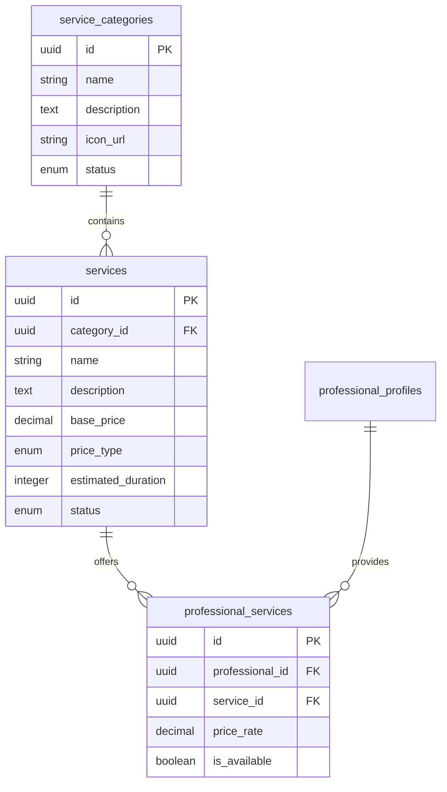
```mermaid
erDiagram
    service_categories ||--o{ services : contains
    services ||--o{ professional_services : offers
    professional_profiles ||--o{ professional_services : provides
    service_categories {
        uuid id PK
        string name
        text description
        string icon_url
        enum status
    }
    services {
        uuid id PK
        uuid category_id FK
        string name
        text description
        decimal base_price
        enum price_type
        integer estimated_duration
        enum status
    }
    professional_services {
        uuid id PK
        uuid professional_id FK
        uuid service_id FK
        decimal price_rate
        boolean is_available
    }
```

#### Job Management System
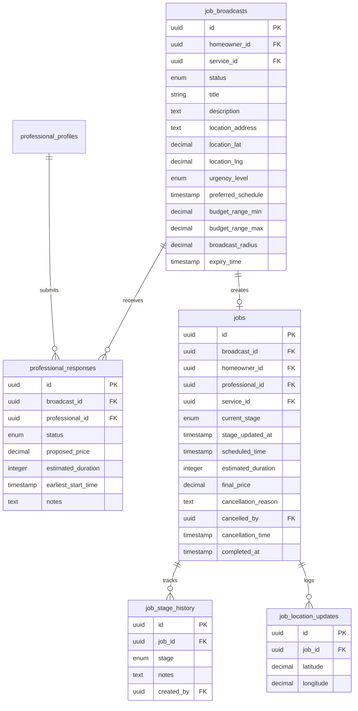
```mermaid
erDiagram
    job_broadcasts ||--o{ professional_responses : receives
    job_broadcasts ||--o| jobs : creates
    professional_profiles ||--o{ professional_responses : submits
    jobs ||--o{ job_stage_history : tracks
    jobs ||--o{ job_location_updates : logs

    job_broadcasts {
        uuid id PK
        uuid homeowner_id FK
        uuid service_id FK
        enum status
        string title
        text description
        text location_address
        decimal location_lat
        decimal location_lng
        enum urgency_level
        timestamp preferred_schedule
        decimal budget_range_min
        decimal budget_range_max
        decimal broadcast_radius
        timestamp expiry_time
    }

    professional_responses {
        uuid id PK
        uuid broadcast_id FK
        uuid professional_id FK
        enum status
        decimal proposed_price
        integer estimated_duration
        timestamp earliest_start_time
        text notes
    }

    jobs {
        uuid id PK
        uuid broadcast_id FK
        uuid homeowner_id FK
        uuid professional_id FK
        uuid service_id FK
        enum current_stage
        timestamp stage_updated_at
        timestamp scheduled_time
        integer estimated_duration
        decimal final_price
        text cancellation_reason
        uuid cancelled_by FK
        timestamp cancellation_time
        timestamp completed_at
    }

    job_stage_history {
        uuid id PK
        uuid job_id FK
        enum stage
        text notes
        uuid created_by FK
    }

    job_location_updates {
        uuid id PK
        uuid job_id FK
        decimal latitude
        decimal longitude
    }
```

### Job Stage Flow
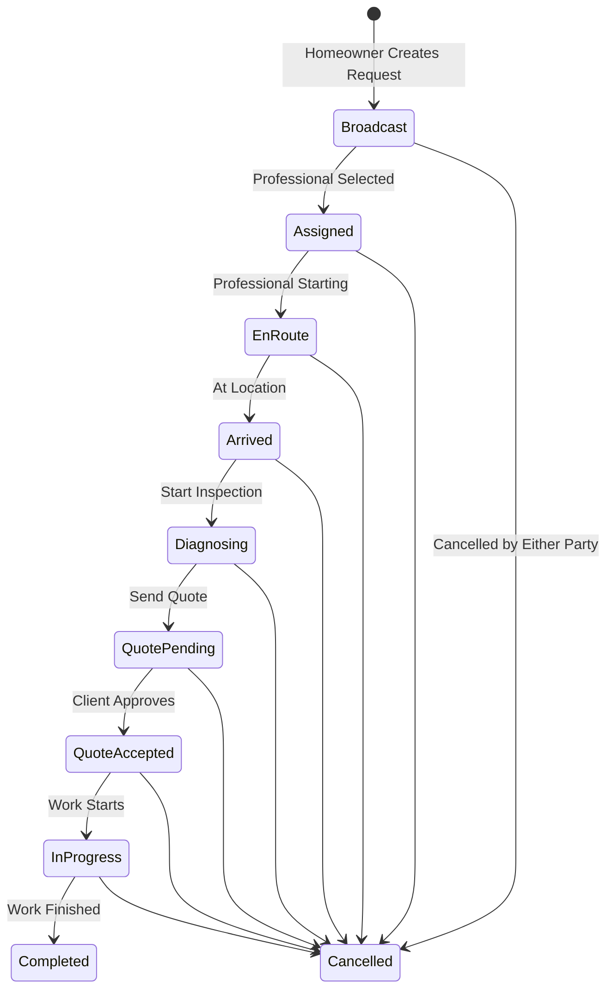
```mermaid
stateDiagram-v2
    [*] --> Broadcast: Homeowner Creates Request
    Broadcast --> Assigned: Professional Selected
    Assigned --> EnRoute: Professional Starting
    EnRoute --> Arrived: At Location
    Arrived --> Diagnosing: Start Inspection
    Diagnosing --> QuotePending: Send Quote
    QuotePending --> QuoteAccepted: Client Approves
    QuoteAccepted --> InProgress: Work Starts
    InProgress --> Completed: Work Finished
    
    Broadcast --> Cancelled: Cancelled by Either Party
    Assigned --> Cancelled
    EnRoute --> Cancelled
    Arrived --> Cancelled
    Diagnosing --> Cancelled
    QuotePending --> Cancelled
    QuoteAccepted --> Cancelled
    InProgress --> Cancelled
```

#### Diagnosis and Quote Management
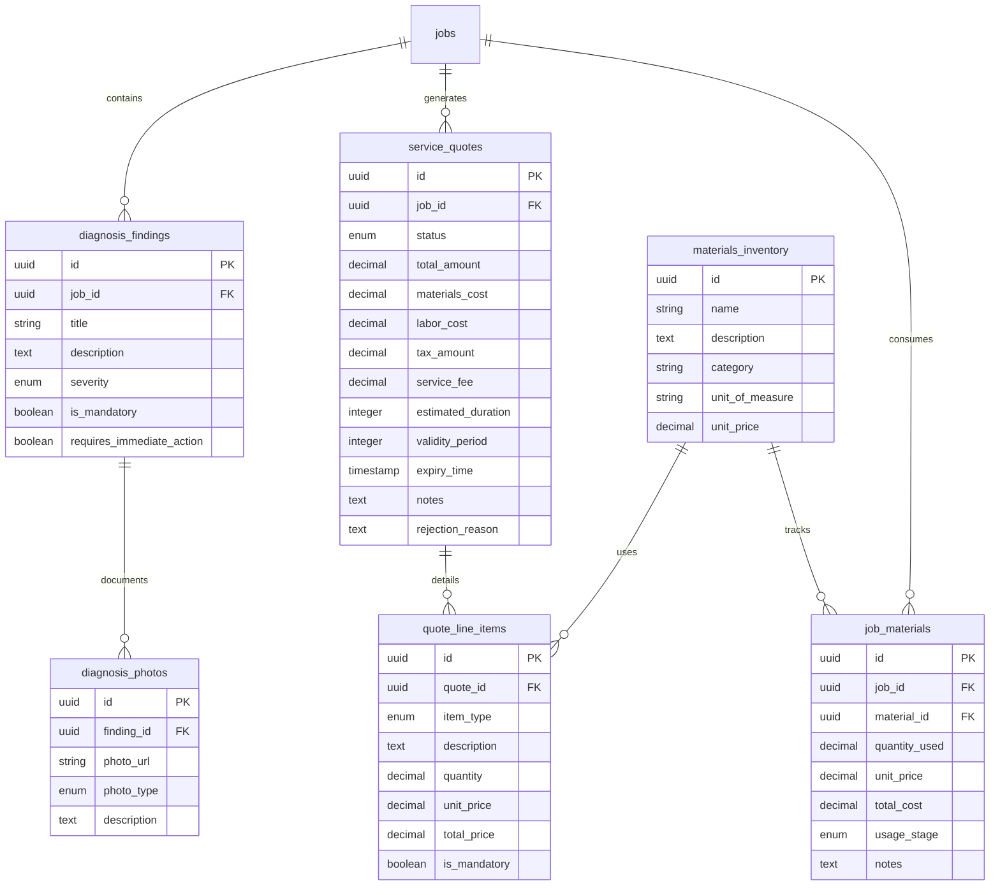
```mermaid
erDiagram
    jobs ||--o{ diagnosis_findings : contains
    diagnosis_findings ||--o{ diagnosis_photos : documents
    jobs ||--o{ service_quotes : generates
    service_quotes ||--o{ quote_line_items : details
    materials_inventory ||--o{ quote_line_items : uses
    jobs ||--o{ job_materials : consumes
    materials_inventory ||--o{ job_materials : tracks

    diagnosis_findings {
        uuid id PK
        uuid job_id FK
        string title
        text description
        enum severity
        boolean is_mandatory
        boolean requires_immediate_action
    }

    diagnosis_photos {
        uuid id PK
        uuid finding_id FK
        string photo_url
        enum photo_type
        text description
    }

    service_quotes {
        uuid id PK
        uuid job_id FK
        enum status
        decimal total_amount
        decimal materials_cost
        decimal labor_cost
        decimal tax_amount
        decimal service_fee
        integer estimated_duration
        integer validity_period
        timestamp expiry_time
        text notes
        text rejection_reason
    }

    quote_line_items {
        uuid id PK
        uuid quote_id FK
        enum item_type
        text description
        decimal quantity
        decimal unit_price
        decimal total_price
        boolean is_mandatory
    }

    materials_inventory {
        uuid id PK
        string name
        text description
        string category
        string unit_of_measure
        decimal unit_price
    }

    job_materials {
        uuid id PK
        uuid job_id FK
        uuid material_id FK
        decimal quantity_used
        decimal unit_price
        decimal total_cost
        enum usage_stage
        text notes
    }
```

### Job Completion and Time Tracking
```mermaid
erDiagram
    jobs ||--o{ job_time_tracking : logs
    services ||--o{ completion_checklist_templates : defines
    jobs ||--o{ job_completion_checklist : requires
    completion_checklist_templates ||--o{ job_completion_checklist : uses

    job_time_tracking {
        uuid id PK
        uuid job_id FK
        timestamp start_time
        timestamp end_time
        integer duration
        enum activity_type
        text notes
    }

    completion_checklist_templates {
        uuid id PK
        uuid service_id FK
        string title
        boolean is_required
    }

    job_completion_checklist {
        uuid id PK
        uuid job_id FK
        uuid template_id FK
        enum status
        text notes
        timestamp completed_at
        uuid verified_by FK
    }
```

### Key Features Implementation

#### Real-time Location Tracking
- Continuous professional location updates during active jobs
- Geofencing for job site arrival detection
- ETA calculations and updates
- Client notification system

#### Service Documentation
- Photo documentation with before/after comparisons
- Issue severity classification
- Mandatory and optional findings
- Material usage tracking

#### Quote Management
- Dynamic pricing based on findings
- Material and labor cost separation
- Multiple quote versions support
- Validity period tracking

## Application Architecture

### Project Structure
```
lib/
├── app.dart                # App entry with providers and configuration
├── main.dart              # Entry point with initializations
├── core/                  # Core functionality
│   ├── config/            # App configuration
│   ├── constants/         # App constants
│   ├── errors/           # Error handling
│   ├── logging/          # Logging service
│   ├── navigation/       # Navigation service
│   ├── network/          # API client and interceptors
│   └── utils/            # Utility functions
├── features/             # Feature modules
│   ├── auth/            # Authentication
│   ├── job_management/  # Job handling
│   ├── location/        # Location services
│   ├── messaging/       # Communication
│   ├── profile/         # User profiles
│   └── service_quotes/  # Quote management
├── shared/              # Shared components
│   ├── widgets/         # Reusable widgets
│   ├── models/          # Shared data models
│   └── providers/       # Shared providers
└── generated/           # Generated files
```

### State Management

#### Riverpod Patterns
```dart
// State provider example
@riverpod
class JobState extends _$JobState {
  @override
  FutureOr<Job> build(String jobId) async {
    try {
      return await _jobRepository.getJob(jobId);
    } catch (e, stack) {
      throw CustomError(e.toString());
    }
  }

  Future<void> updateJobStatus(JobStatus newStatus) async {
    state = const AsyncValue.loading();
    state = await AsyncValue.guard(() async {
      final updatedJob = await _jobRepository.updateStatus(
        jobId: jobId,
        status: newStatus,
      );
      return updatedJob;
    });
  }
}
```

### Error Handling

```dart
// Global error handler
@riverpod
class ErrorHandler extends _$ErrorHandler {
  @override
  void build() {
    ref.onDispose(() {
      // Cleanup
    });
  }

  void handleError(Object error, StackTrace? stackTrace) {
    if (error is NetworkException) {
      _handleNetworkError(error);
    } else if (error is ValidationException) {
      _handleValidationError(error);
    } else {
      _handleUnexpectedError(error, stackTrace);
    }
  }
}
```

### Navigation

```dart
// Route configuration
@riverpod
class RouterConfig extends _$RouterConfig {
  @override
  GoRouter build() {
    return GoRouter(
      routes: [
        GoRoute(
          path: '/',
          builder: (context, state) => const HomeScreen(),
          routes: [
            GoRoute(
              path: 'jobs/:jobId',
              builder: (context, state) => JobDetailsScreen(
                jobId: state.params['jobId']!,
              ),
            ),
          ],
        ),
      ],
    );
  }
}
```

### Real-time Updates

```dart
// WebSocket connection manager
@riverpod
class WebSocketConnection extends _$WebSocketConnection {
  @override
  Stream<WebSocketEvent> build() {
    return _webSocketService
        .connect()
        .map((event) => WebSocketEvent.fromJson(event));
  }

  void sendMessage(WebSocketMessage message) {
    _webSocketService.send(message.toJson());
  }
}
```

### Location Services

```dart
// Location tracking provider
@riverpod
class LocationTracker extends _$LocationTracker {
  @override
  Stream<Position> build() {
    return _locationService.getPositionStream(
      desiredAccuracy: LocationAccuracy.high,
      distanceFilter: 10, // meters
    );
  }

  Future<void> updateJobLocation(String jobId, Position position) async {
    await _jobRepository.updateLocation(
      jobId: jobId,
      latitude: position.latitude,
      longitude: position.longitude,
    );
  }
}
```

### Dependency Injection

```dart
// Repository provider
@riverpod
JobRepository jobRepository(JobRepositoryRef ref) {
  return JobRepository(
    apiClient: ref.watch(apiClientProvider),
    localStorage: ref.watch(localStorageProvider),
  );
}

// Service provider
@riverpod
LocationService locationService(LocationServiceRef ref) {
  return LocationService(
    settings: ref.watch(locationSettingsProvider),
  );
}
```

## Development Setup

### Prerequisites
- Flutter SDK (latest stable version)
- Dart SDK (latest stable version)
- Android Studio / VS Code with Flutter extensions
- iOS development setup for Mac users

### Environment Setup
1. Clone the repository
```bash
git clone https://github.com/your-org/voltzy-professional.git
cd voltzy-professional
```

2. Install dependencies
```bash
flutter pub get
```

3. Run code generation
```bash
flutter pub run build_runner build --delete-conflicting-outputs
```

4. Setup environment variables
```bash
cp .env.example .env
# Edit .env with your configuration
```

### Running the App
```bash
# Development
flutter run --flavor development --target lib/main_development.dart

# Staging
flutter run --flavor staging --target lib/main_staging.dart

# Production
flutter run --flavor production --target lib/main_production.dart
```

## Testing Strategy

### Unit Testing

```dart
// Repository test example
void main() {
  group('JobRepository', () {
    late JobRepository repository;
    late MockApiClient mockApiClient;
    late MockLocalStorage mockLocalStorage;

    setUp(() {
      mockApiClient = MockApiClient();
      mockLocalStorage = MockLocalStorage();
      repository = JobRepository(
        apiClient: mockApiClient,
        localStorage: mockLocalStorage,
      );
    });

    test('getJob returns job from API', () async {
      // Arrange
      const jobId = 'test-job-id';
      final expectedJob = Job(id: jobId, status: JobStatus.pending);
      when(() => mockApiClient.getJob(jobId))
          .thenAnswer((_) async => expectedJob);

      // Act
      final result = await repository.getJob(jobId);

      // Assert
      expect(result, equals(expectedJob));
      verify(() => mockApiClient.getJob(jobId)).called(1);
    });
  });
}
```

### Widget Testing

```dart
// Widget test example
void main() {
  group('JobDetailsScreen', () {
    late MockJobRepository mockJobRepository;

    setUp(() {
      mockJobRepository = MockJobRepository();
    });

    testWidgets('displays job details when loaded', (tester) async {
      // Arrange
      const jobId = 'test-job-id';
      final job = Job(id: jobId, status: JobStatus.inProgress);
      when(() => mockJobRepository.getJob(jobId))
          .thenAnswer((_) async => job);

      // Act
      await tester.pumpWidget(
        ProviderScope(
          overrides: [
            jobRepositoryProvider.overrideWithValue(mockJobRepository),
          ],
          child: MaterialApp(
            home: JobDetailsScreen(jobId: jobId),
          ),
        ),
      );
      await tester.pumpAndSettle();

      // Assert
      expect(find.text(jobId), findsOneWidget);
      expect(find.byType(JobStatusBadge), findsOneWidget);
    });
  });
}
```

### Integration Testing

```dart
void main() {
  IntegrationTestWidgetsFlutterBinding.ensureInitialized();

  group('end-to-end test', () {
    testWidgets('complete job flow', (tester) async {
      // Start app
      app.main();
      await tester.pumpAndSettle();

      // Login
      await tester.enterText(
        find.byKey(const Key('emailField')), 
        'test@example.com'
      );
      await tester.enterText(
        find.byKey(const Key('passwordField')), 
        'password123'
      );
      await tester.tap(find.byKey(const Key('loginButton')));
      await tester.pumpAndSettle();

      // Navigate to jobs
      await tester.tap(find.byKey(const Key('jobsTab')));
      await tester.pumpAndSettle();

      // Verify job list
      expect(find.byType(JobCard), findsWidgets);
    });
  });
}
```

### Code Quality Tools

#### Static Analysis
```yaml
# analysis_options.yaml
include: package:very_good_analysis/analysis_options.yaml

analyzer:
  exclude:
    - "**/*.g.dart"
    - "**/*.freezed.dart"
  strong-mode:
    implicit-casts: false
    implicit-dynamic: false
  errors:
    invalid_annotation_target: ignore

linter:
  rules:
    public_member_api_docs: false
    sort_pub_dependencies: true
```

#### CI/CD Pipeline

```yaml
# .github/workflows/main.yml
name: CI
on:
  push:
    branches: [ main ]
  pull_request:
    branches: [ main ]

jobs:
  build:
    runs-on: ubuntu-latest
    steps:
      - uses: actions/checkout@v3
      - uses: subosito/flutter-action@v2
      
      - name: Install Dependencies
        run: flutter pub get
        
      - name: Format
        run: dart format --set-exit-if-changed .
        
      - name: Analyze
        run: flutter analyze .
        
      - name: Run Tests
        run: flutter test --coverage
        
      - name: Upload Coverage
        uses: codecov/codecov-action@v3
```

### Performance Testing

#### Memory Leaks
```dart
// Memory leak test example
test('no memory leaks in JobState', () async {
  final container = ProviderContainer();
  addTearDown(container.dispose);

  // Create and dispose multiple instances
  for (var i = 0; i < 100; i++) {
    final jobState = container.read(jobStateProvider('job-$i'));
    await jobState.future;
  }

  // Verify no memory leaks
  expect(container.getAllProviderElements().length, equals(0));
});
```

#### Widget Performance
```dart
// Performance test example
test('JobList renders efficiently', () async {
  final stopwatch = Stopwatch()..start();
  
  await tester.pumpWidget(
    MaterialApp(
      home: JobList(jobs: List.generate(100, (i) => Job(id: 'job-$i'))),
    ),
  );
  
  stopwatch.stop();
  expect(stopwatch.elapsedMilliseconds, lessThan(16)); // 60 FPS threshold
});
```

## Quality Assurance Checklist

### Before Submitting PR
- [ ] Run `flutter analyze` with no issues
- [ ] Run `flutter test` with all tests passing
- [ ] Run `flutter test --coverage` with >80% coverage
- [ ] Run `flutter format .` for consistent styling
- [ ] Test on both Android and iOS devices
- [ ] Verify no memory leaks
- [ ] Check widget rebuild optimization
- [ ] Verify error handling
- [ ] Test offline functionality
- [ ] Review security considerations

### Code Review Guidelines
1. Architecture Compliance
   - Follows feature-first architecture
   - Proper use of Riverpod providers
   - Clear separation of concerns

2. State Management
   - Proper error handling
   - Loading states managed
   - Proper disposal of resources
   - Efficient rebuild strategy

3. Performance
   - Minimal widget rebuilds
   - Proper use of const constructors
   - Efficient list rendering
   - Memory management

4. Testing
   - Unit tests for business logic
   - Widget tests for UI components
   - Integration tests for flows
   - Edge cases covered

## API Integration & Security

### API Client Setup

```dart
// Base API client configuration
@riverpod
class ApiClient extends _$ApiClient {
  @override
  Dio build() {
    final dio = Dio(BaseOptions(
      baseUrl: ref.watch(environmentConfigProvider).apiBaseUrl,
      connectTimeout: const Duration(seconds: 30),
      receiveTimeout: const Duration(seconds: 30),
      headers: {'Accept': 'application/json'},
    ));

    // Add interceptors
    dio.interceptors.addAll([
      AuthInterceptor(ref),
      LoggingInterceptor(),
      ErrorInterceptor(),
      RetryInterceptor(),
    ]);

    return dio;
  }
}

// Auth interceptor
class AuthInterceptor extends Interceptor {
  final Ref ref;

  AuthInterceptor(this.ref);

  @override
  void onRequest(
    RequestOptions options,
    RequestInterceptorHandler handler,
  ) async {
    final token = await ref.read(authTokenProvider.future);
    if (token != null) {
      options.headers['Authorization'] = 'Bearer $token';
    }
    handler.next(options);
  }
}

// Error interceptor
class ErrorInterceptor extends Interceptor {
  @override
  void onError(DioError err, ErrorInterceptorHandler handler) {
    switch (err.type) {
      case DioErrorType.connectionTimeout:
      case DioErrorType.sendTimeout:
      case DioErrorType.receiveTimeout:
        throw NetworkTimeoutException(err.message);
      case DioErrorType.badResponse:
        _handleErrorResponse(err.response!);
        break;
      default:
        throw NetworkException(err.message);
    }
  }

  void _handleErrorResponse(Response response) {
    switch (response.statusCode) {
      case 401:
        throw UnauthorizedException();
      case 403:
        throw ForbiddenException();
      case 404:
        throw NotFoundException();
      default:
        throw ApiException(
          response.statusCode,
          response.data['message'] ?? 'Unknown error',
        );
    }
  }
}
```

### Secure Storage

```dart
// Secure storage service
@riverpod
class SecureStorage extends _$SecureStorage {
  static const _tokenKey = 'auth_token';
  static const _refreshTokenKey = 'refresh_token';
  
  late final FlutterSecureStorage _storage;

  @override
  Future<void> build() async {
    _storage = const FlutterSecureStorage(
      aOptions: AndroidOptions(
        encryptedSharedPreferences: true,
      ),
      iOptions: IOSOptions(
        accessibility: KeychainAccessibility.first_unlock,
      ),
    );
  }

  Future<void> saveToken(String token) async {
    await _storage.write(key: _tokenKey, value: token);
  }

  Future<String?> getToken() async {
    return await _storage.read(key: _tokenKey);
  }

  Future<void> deleteToken() async {
    await _storage.delete(key: _tokenKey);
  }
}
```

### API Endpoints

```dart
// Job API endpoints
@riverpod
class JobApi extends _$JobApi {
  @override
  Future<void> build() async {}

  Future<List<Job>> getJobs({
    required JobStatus status,
    required int page,
    required int limit,
  }) async {
    final response = await ref.read(apiClientProvider).get(
      '/jobs',
      queryParameters: {
        'status': status.name,
        'page': page,
        'limit': limit,
      },
    );
    return (response.data['data'] as List)
        .map((json) => Job.fromJson(json))
        .toList();
  }

  Future<Job> updateJobStatus(String jobId, JobStatus status) async {
    final response = await ref.read(apiClientProvider).patch(
      '/jobs/$jobId/status',
      data: {'status': status.name},
    );
    return Job.fromJson(response.data);
  }
}
```

### Security Best Practices

#### 1. Authentication
- Secure token storage using platform-specific encryption
- Automatic token refresh handling
- Biometric authentication support
- Session management and timeout

#### 2. Data Protection
- End-to-end encryption for sensitive data
- Secure local storage
- Data masking in logs
- Certificate pinning

#### 3. Network Security
- HTTPS-only connections
- Certificate validation
- Request signing
- API rate limiting

#### 4. Code Security
- ProGuard configuration for Android
- iOS security settings
- Dependency security scanning
- Regular security updates

### Security Configuration

```yaml
# android/app/build.gradle
android {
    defaultConfig {
        // Security configurations
        ndk {
            abiFilters 'armeabi-v7a', 'arm64-v8a', 'x86_64'
        }
    }
    
    buildTypes {
        release {
            // Enable ProGuard
            minifyEnabled true
            shrinkResources true
            proguardFiles getDefaultProguardFile('proguard-android.txt'),
                    'proguard-rules.pro'
        }
    }
}

# ios/Runner/Info.plist
<key>ITSAppUsesNonExemptEncryption</key>
<false/>
<key>NSFaceIDUsageDescription</key>
<string>We use Face ID to secure your account</string>
```

### API Error Handling

```dart
// API error types
sealed class ApiError implements Exception {
  final String message;
  const ApiError(this.message);
}

class NetworkException extends ApiError {
  const NetworkException(super.message);
}

class UnauthorizedException extends ApiError {
  const UnauthorizedException() : super('Unauthorized access');
}

class ForbiddenException extends ApiError {
  const ForbiddenException() : super('Access forbidden');
}

// Error handling in repositories
@riverpod
class JobRepository extends _$JobRepository {
  @override
  Future<void> build() async {}

  Future<Job> getJob(String jobId) async {
    try {
      return await ref.read(jobApiProvider).getJob(jobId);
    } on UnauthorizedException {
      await ref.read(authRepositoryProvider).refreshToken();
      return await ref.read(jobApiProvider).getJob(jobId);
    } on ApiError catch (e) {
      ref.read(errorHandlerProvider).handleError(e);
      rethrow;
    }
  }
}
```

## UI/UX Guidelines

### Design System

```dart
// Theme configuration
@riverpod
class AppTheme extends _$AppTheme {
  @override
  ThemeData build() {
    return ThemeData(
      useMaterial3: true,
      colorScheme: ColorScheme.fromSeed(
        seedColor: const Color(0xFF2196F3),
        brightness: ref.watch(themeModeProvider) == ThemeMode.dark
            ? Brightness.dark
            : Brightness.light,
      ),
      // Typography
      textTheme: TextTheme(
        displayLarge: GoogleFonts.inter(
          fontSize: 32,
          fontWeight: FontWeight.bold,
        ),
        bodyLarge: GoogleFonts.inter(
          fontSize: 16,
          fontWeight: FontWeight.normal,
        ),
      ),
      // Component themes
      cardTheme: const CardTheme(
        elevation: 2,
        margin: EdgeInsets.all(8),
      ),
    );
  }
}
```

### Core Components

#### 1. Status Badges
```dart
class StatusBadge extends StatelessWidget {
  final JobStatus status;

  const StatusBadge({super.key, required this.status});

  @override
  Widget build(BuildContext context) {
    return Container(
      padding: const EdgeInsets.symmetric(
        horizontal: 12,
        vertical: 6,
      ),
      decoration: BoxDecoration(
        color: _getStatusColor(status),
        borderRadius: BorderRadius.circular(16),
      ),
      child: Text(
        status.displayName,
        style: Theme.of(context).textTheme.labelMedium?.copyWith(
          color: Colors.white,
        ),
      ),
    );
  }

  Color _getStatusColor(JobStatus status) {
    return switch (status) {
      JobStatus.pending => Colors.orange,
      JobStatus.inProgress => Colors.blue,
      JobStatus.completed => Colors.green,
      JobStatus.cancelled => Colors.red,
    };
  }
}
```

#### 2. Action Buttons
```dart
class PrimaryButton extends StatelessWidget {
  final String label;
  final VoidCallback? onPressed;
  final bool isLoading;

  const PrimaryButton({
    super.key,
    required this.label,
    this.onPressed,
    this.isLoading = false,
  });

  @override
  Widget build(BuildContext context) {
    return FilledButton(
      onPressed: isLoading ? null : onPressed,
      child: isLoading
          ? const CircularProgressIndicator()
          : Text(label),
    );
  }
}
```

### Screen Templates

#### 1. List Screen
```dart
class JobListScreen extends ConsumerWidget {
  const JobListScreen({super.key});

  @override
  Widget build(BuildContext context, WidgetRef ref) {
    final jobs = ref.watch(jobListProvider);

    return Scaffold(
      appBar: AppBar(
        title: const Text('Jobs'),
        actions: [
          FilterButton(
            onFilterChanged: (filter) {
              ref.read(jobFilterProvider.notifier).state = filter;
            },
          ),
        ],
      ),
      body: jobs.when(
        data: (data) => JobList(jobs: data),
        loading: () => const LoadingIndicator(),
        error: (error, stack) => ErrorView(
          message: error.toString(),
          onRetry: () => ref.refresh(jobListProvider),
        ),
      ),
    );
  }
}
```

#### 2. Detail Screen
```dart
class JobDetailScreen extends ConsumerWidget {
  final String jobId;

  const JobDetailScreen({
    super.key,
    required this.jobId,
  });

  @override
  Widget build(BuildContext context, WidgetRef ref) {
    final job = ref.watch(jobProvider(jobId));

    return Scaffold(
      appBar: AppBar(
        title: const Text('Job Details'),
        actions: [
          ShareButton(jobId: jobId),
        ],
      ),
      body: job.when(
        data: (data) => JobDetailView(job: data),
        loading: () => const LoadingIndicator(),
        error: (error, stack) => ErrorView(
          message: error.toString(),
          onRetry: () => ref.refresh(jobProvider(jobId)),
        ),
      ),
    );
  }
}
```

### Responsive Design

```dart
// Screen size utilities
class Responsive {
  static bool isMobile(BuildContext context) =>
      MediaQuery.of(context).size.width < 600;

  static bool isTablet(BuildContext context) =>
      MediaQuery.of(context).size.width >= 600 &&
      MediaQuery.of(context).size.width < 900;

  static bool isDesktop(BuildContext context) =>
      MediaQuery.of(context).size.width >= 900;

  static double gutterSpacing(BuildContext context) {
    if (isMobile(context)) return 16;
    if (isTablet(context)) return 24;
    return 32;
  }
}

// Responsive layout example
class ResponsiveJobList extends StatelessWidget {
  final List<Job> jobs;

  const ResponsiveJobList({
    super.key,
    required this.jobs,
  });

  @override
  Widget build(BuildContext context) {
    return LayoutBuilder(
      builder: (context, constraints) {
        final crossAxisCount = switch (constraints.maxWidth) {
          < 600 => 1,
          < 900 => 2,
          _ => 3,
        };

        return GridView.builder(
          gridDelegate: SliverGridDelegateWithFixedCrossAxisCount(
            crossAxisCount: crossAxisCount,
            childAspectRatio: 1.5,
            mainAxisSpacing: Responsive.gutterSpacing(context),
            crossAxisSpacing: Responsive.gutterSpacing(context),
          ),
          itemCount: jobs.length,
          itemBuilder: (context, index) => JobCard(
            job: jobs[index],
          ),
        );
      },
    );
  }
}
```

### Animation Guidelines

```dart
// Page transitions
class FadePageRoute<T> extends PageRoute<T> {
  final Widget child;

  FadePageRoute({required this.child});

  @override
  Color? get barrierColor => null;

  @override
  String? get barrierLabel => null;

  @override
  Widget buildPage(context, animation, secondaryAnimation) {
    return FadeTransition(
      opacity: animation,
      child: child,
    );
  }

  @override
  bool get maintainState => true;

  @override
  Duration get transitionDuration => const Duration(milliseconds: 300);
}

// Loading animations
class LoadingIndicator extends StatelessWidget {
  const LoadingIndicator({super.key});

  @override
  Widget build(BuildContext context) {
    return Center(
      child: LoadingAnimationWidget.staggeredDotsWave(
        color: Theme.of(context).colorScheme.primary,
        size: 40,
      ),
    );
  }
}
```

### Accessibility Guidelines

1. Text Scaling
```dart
class AccessibleText extends StatelessWidget {
  final String text;
  final TextStyle? style;

  const AccessibleText({
    super.key,
    required this.text,
    this.style,
  });

  @override
  Widget build(BuildContext context) {
    return MediaQuery(
      data: MediaQuery.of(context).copyWith(
        textScaleFactor: MediaQuery.of(context).textScaleFactor.clamp(1.0, 1.3),
      ),
      child: Text(
        text,
        style: style,
      ),
    );
  }
}
```

2. Color Contrast
```dart
extension ColorContrast on Color {
  bool hasGoodContrast(Color background) {
    final contrast = ColorUtils.calculateContrast(this, background);
    return contrast >= 4.5; // WCAG AA standard
  }

  Color ensureContrast(Color background) {
    if (hasGoodContrast(background)) return this;
    return ColorUtils.adjustBrightness(this, background);
  }
}
```

### Error States

```dart
class ErrorView extends StatelessWidget {
  final String message;
  final VoidCallback? onRetry;

  const ErrorView({
    super.key,
    required this.message,
    this.onRetry,
  });

  @override
  Widget build(BuildContext context) {
    return Center(
      child: Column(
        mainAxisAlignment: MainAxisAlignment.center,
        children: [
          Icon(
            Icons.error_outline,
            size: 48,
            color: Theme.of(context).colorScheme.error,
          ),
          const SizedBox(height: 16),
          Text(
            message,
            style: Theme.of(context).textTheme.bodyLarge,
            textAlign: TextAlign.center,
          ),
          if (onRetry != null) ...[
            const SizedBox(height: 16),
            FilledButton.icon(
              onPressed: onRetry,
              icon: const Icon(Icons.refresh),
              label: const Text('Retry'),
            ),
          ],
        ],
      ),
    );
  }
}
```

## Contributing

[Contribution guidelines to be added...]

## License

[License information to be added...]

## Deployment & Release Management

### Build Configuration

```yaml
# pubspec.yaml
name: voltzy_professional
description: Professional service management platform
version: 1.0.0+1

environment:
  sdk: ">=3.0.0 <4.0.0"
  flutter: ">=3.10.0"

dependencies:
  flutter:
    sdk: flutter
  # State Management
  flutter_riverpod: ^2.4.0
  riverpod_annotation: ^2.1.0
  
  # Navigation
  go_router: ^12.0.0
  
  # Network
  dio: ^5.0.0
  retrofit: ^4.0.0
  
  # Storage
  flutter_secure_storage: ^9.0.0
  shared_preferences: ^2.0.0
  
  # UI
  google_fonts: ^6.0.0
  flutter_animate: ^4.0.0
  loading_animation_widget: ^1.0.0
  
  # Location
  geolocator: ^10.0.0
  google_maps_flutter: ^2.0.0
  
  # Utils
  freezed_annotation: ^2.0.0
  json_annotation: ^4.0.0
  logger: ^2.0.0

dev_dependencies:
  flutter_test:
    sdk: flutter
  integration_test:
    sdk: flutter
  build_runner: ^2.4.0
  riverpod_generator: ^2.3.0
  freezed: ^2.4.0
  json_serializable: ^6.7.0
  flutter_lints: ^3.0.0
  mocktail: ^1.0.0
```

### Environment Configuration

```dart
// lib/core/config/env_config.dart
enum Environment { development, staging, production }

@riverpod
class EnvironmentConfig extends _$EnvironmentConfig {
  @override
  EnvConfig build() {
    const env = String.fromEnvironment(
      'ENVIRONMENT',
      defaultValue: 'development',
    );

    return switch (env) {
      'development' => EnvConfig.development(),
      'staging' => EnvConfig.staging(),
      'production' => EnvConfig.production(),
      _ => throw Exception('Invalid environment'),
    };
  }
}

class EnvConfig {
  final Environment environment;
  final String apiBaseUrl;
  final String mapsApiKey;
  
  const EnvConfig._({
    required this.environment,
    required this.apiBaseUrl,
    required this.mapsApiKey,
  });

  factory EnvConfig.development() => const EnvConfig._(
    environment: Environment.development,
    apiBaseUrl: 'https://dev-api.voltzy.com',
    mapsApiKey: 'dev_maps_key',
  );

  factory EnvConfig.staging() => const EnvConfig._(
    environment: Environment.staging,
    apiBaseUrl: 'https://staging-api.voltzy.com',
    mapsApiKey: 'staging_maps_key',
  );

  factory EnvConfig.production() => const EnvConfig._(
    environment: Environment.production,
    apiBaseUrl: 'https://api.voltzy.com',
    mapsApiKey: 'prod_maps_key',
  );
}
```

### Release Process

#### 1. Version Management
```dart
// lib/core/config/version.dart
class AppVersion {
  static const String version = '1.0.0';
  static const int buildNumber = 1;
  
  static String get fullVersion => '$version+$buildNumber';
  
  static bool needsUpdate(String minimumVersion) {
    return Version.parse(version) < Version.parse(minimumVersion);
  }
}
```

#### 2. Build Commands

```bash
# Development Build
flutter build apk --flavor development --dart-define=ENVIRONMENT=development
flutter build ios --flavor development --dart-define=ENVIRONMENT=development

# Staging Build
flutter build apk --flavor staging --dart-define=ENVIRONMENT=staging
flutter build ios --flavor staging --dart-define=ENVIRONMENT=staging

# Production Build
flutter build apk --flavor production --dart-define=ENVIRONMENT=production
flutter build ios --flavor production --dart-define=ENVIRONMENT=production
```

### CI/CD Pipeline

```yaml
# .github/workflows/deploy.yml
name: Deploy
on:
  push:
    tags:
      - 'v*'

jobs:
  deploy:
    runs-on: macos-latest
    steps:
      - uses: actions/checkout@v3
      
      - name: Setup Flutter
        uses: subosito/flutter-action@v2
        with:
          flutter-version: '3.13.0'
          
      - name: Install Dependencies
        run: flutter pub get
        
      - name: Build Android
        run: flutter build apk --flavor production --dart-define=ENVIRONMENT=production
        
      - name: Build iOS
        run: flutter build ios --flavor production --dart-define=ENVIRONMENT=production
        
      - name: Deploy to Play Store
        uses: r0adkll/upload-google-play@v1
        with:
          serviceAccountJsonPlainText: ${{ secrets.PLAYSTORE_ACCOUNT_KEY }}
          packageName: com.voltzy.professional
          releaseFiles: build/app/outputs/flutter-apk/app-production-release.apk
          track: production
          
      - name: Deploy to App Store
        uses: apple-actions/upload-testflight@v1
        with:
          app-path: build/ios/ipa/voltzy_professional.ipa
          api-key: ${{ secrets.APPSTORE_API_KEY }}
          api-key-id: ${{ secrets.APPSTORE_API_KEY_ID }}
          api-issuer-id: ${{ secrets.APPSTORE_ISSUER_ID }}
```

### Release Checklist

#### Pre-Release
1. Code Freeze
   - Feature completion verification
   - Bug fixes completed
   - Documentation updated

2. Testing
   - Unit tests passing
   - Widget tests passing
   - Integration tests passing
   - Manual testing completed
   - Performance testing completed

3. Code Quality
   - Static analysis clean
   - Code review completed
   - Technical debt addressed
   - Security review completed

4. Documentation
   - API documentation updated
   - Release notes prepared
   - User documentation updated
   - Known issues documented

#### Release
1. Version Update
   - Update version in pubspec.yaml
   - Update changelog
   - Create release tag

2. Build Generation
   - Generate production builds
   - Sign builds with production keys
   - Archive builds

3. Store Submission
   - Update store listings
   - Submit for review
   - Monitor review status

4. Release Monitoring
   - Monitor crash reports
   - Track user feedback
   - Monitor performance metrics
   - Track adoption rate

### Monitoring & Analytics

```dart
// lib/core/analytics/analytics_service.dart
@riverpod
class AnalyticsService extends _$AnalyticsService {
  @override
  void build() {
    ref.onDispose(() {
      // Cleanup
    });
  }

  Future<void> logEvent(String name, {Map<String, dynamic>? parameters}) async {
    await FirebaseAnalytics.instance.logEvent(
      name: name,
      parameters: parameters,
    );
  }

  Future<void> logError(String message, dynamic error) async {
    await FirebaseCrashlytics.instance.recordError(
      error,
      null,
      reason: message,
    );
  }

  Future<void> setUserProperty(String name, String value) async {
    await FirebaseAnalytics.instance.setUserProperty(
      name: name,
      value: value,
    );
  }
}
```

[End of Documentation]

### Active Job Screen Implementation

#### Screen Structure
```dart
class ActiveJobScreen extends ConsumerWidget {
  const ActiveJobScreen({super.key});

  @override
  Widget build(BuildContext context, WidgetRef ref) {
    final jobStage = ref.watch(activeJobStageProvider);
    
    return Scaffold(
      appBar: AppBar(
        title: const Text('Active Job'),
        actions: [
          IconButton(
            icon: const Icon(Icons.emergency),
            onPressed: () => _handleEmergency(context),
          ),
          IconButton(
            icon: const Icon(Icons.message),
            onPressed: () => _openChat(context),
          ),
        ],
      ),
      body: Column(
        children: [
          const JobProgressTracker(),
          Expanded(
            child: switch (jobStage) {
              JobStage.enRoute => const EnRouteView(),
              JobStage.atLocation => const AtLocationView(),
              JobStage.diagnosis => const DiagnosisView(),
              JobStage.quoteCreation => const QuoteCreationView(),
              JobStage.inProgress => const InProgressView(),
              JobStage.completion => const CompletionView(),
            },
          ),
        ],
      ),
    );
  }
}

class JobProgressTracker extends ConsumerWidget {
  const JobProgressTracker({super.key});

  @override
  Widget build(BuildContext context, WidgetRef ref) {
    final currentStage = ref.watch(activeJobStageProvider);
    
    return Container(
      padding: const EdgeInsets.all(16),
      child: Column(
        children: [
          Row(
            children: JobStage.values.map((stage) {
              final isCompleted = stage.index < currentStage.index;
              final isCurrent = stage == currentStage;
              
              return Expanded(
                child: _StageIndicator(
                  stage: stage,
                  isCompleted: isCompleted,
                  isCurrent: isCurrent,
                ),
              );
            }).toList(),
          ),
          const SizedBox(height: 8),
          Text(
            currentStage.displayName,
            style: Theme.of(context).textTheme.titleMedium,
          ),
        ],
      ),
    );
  }
}

// Stage Views Implementation

class EnRouteView extends ConsumerWidget {
  const EnRouteView({super.key});

  @override
  Widget build(BuildContext context, WidgetRef ref) {
    return Stack(
      children: [
        const GoogleMap(
          initialCameraPosition: CameraPosition(
            target: LatLng(0, 0),
            zoom: 15,
          ),
        ),
        Positioned(
          bottom: 0,
          left: 0,
          right: 0,
          child: Container(
            padding: const EdgeInsets.all(16),
            decoration: BoxDecoration(
              color: Theme.of(context).cardColor,
              borderRadius: const BorderRadius.vertical(
                top: Radius.circular(16),
              ),
            ),
            child: Column(
              mainAxisSize: MainAxisSize.min,
              children: [
                Text(
                  'Estimated Time: 15 mins',
                  style: Theme.of(context).textTheme.titleMedium,
                ),
                const SizedBox(height: 16),
                FilledButton(
                  onPressed: () => _markAsArrived(ref),
                  child: const Text('I\'ve Arrived'),
                ),
              ],
            ),
          ),
        ),
      ],
    );
  }
}

class AtLocationView extends ConsumerWidget {
  const AtLocationView({super.key});

  @override
  Widget build(BuildContext context, WidgetRef ref) {
    return Padding(
      padding: const EdgeInsets.all(16),
      child: Column(
        crossAxisAlignment: CrossAxisAlignment.stretch,
        children: [
          const ArrivalVerificationCard(),
          const SizedBox(height: 16),
          const SafetyChecklistCard(),
          const SizedBox(height: 16),
          FilledButton(
            onPressed: () => _proceedToDiagnosis(ref),
            child: const Text('Start Diagnosis'),
          ),
        ],
      ),
    );
  }
}

class DiagnosisView extends ConsumerWidget {
  const DiagnosisView({super.key});

  @override
  Widget build(BuildContext context, WidgetRef ref) {
    return Padding(
      padding: const EdgeInsets.all(16),
      child: Column(
        crossAxisAlignment: CrossAxisAlignment.stretch,
        children: [
          Expanded(
            child: SingleChildScrollView(
              child: Column(
                children: [
                  const IssueCategorySelector(),
                  const SizedBox(height: 16),
                  const PhotoDocumentationSection(),
                  const SizedBox(height: 16),
                  const DiagnosisNotesField(),
                ],
              ),
            ),
          ),
          FilledButton(
            onPressed: () => _createQuote(ref),
            child: const Text('Create Quote'),
          ),
        ],
      ),
    );
  }
}

class QuoteCreationView extends ConsumerWidget {
  const QuoteCreationView({super.key});

  @override
  Widget build(BuildContext context, WidgetRef ref) {
    return Padding(
      padding: const EdgeInsets.all(16),
      child: Column(
        crossAxisAlignment: CrossAxisAlignment.stretch,
        children: [
          Expanded(
            child: SingleChildScrollView(
              child: Column(
                children: [
                  const MaterialsSelectionList(),
                  const SizedBox(height: 16),
                  const LaborCostCalculator(),
                  const SizedBox(height: 16),
                  const QuoteSummary(),
                ],
              ),
            ),
          ),
          FilledButton(
            onPressed: () => _sendQuoteToClient(ref),
            child: const Text('Send Quote to Client'),
          ),
        ],
      ),
    );
  }
}

class InProgressView extends ConsumerWidget {
  const InProgressView({super.key});

  @override
  Widget build(BuildContext context, WidgetRef ref) {
    return Padding(
      padding: const EdgeInsets.all(16),
      child: Column(
        crossAxisAlignment: CrossAxisAlignment.stretch,
        children: [
          const JobTimer(),
          const SizedBox(height: 16),
          const TaskProgressList(),
          const SizedBox(height: 16),
          const MaterialUsageTracker(),
          const Spacer(),
          FilledButton(
            onPressed: () => _completeJob(ref),
            child: const Text('Complete Job'),
          ),
        ],
      ),
    );
  }
}

class CompletionView extends ConsumerWidget {
  const CompletionView({super.key});

  @override
  Widget build(BuildContext context, WidgetRef ref) {
    return Padding(
      padding: const EdgeInsets.all(16),
      child: Column(
        crossAxisAlignment: CrossAxisAlignment.stretch,
        children: [
          const CompletionChecklist(),
          const SizedBox(height: 16),
          const FinalPhotoCapture(),
          const SizedBox(height: 16),
          const ClientSignatureField(),
          const Spacer(),
          FilledButton(
            onPressed: () => _finalizeJob(ref),
            child: const Text('Finalize Job'),
          ),
        ],
      ),
    );
  }
}
